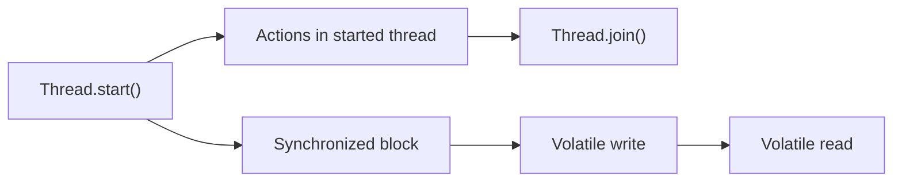

## Part 1 — Understanding Race Conditions in Java (Foundational Concepts)

Concurrency is one of the most fascinating yet error-prone aspects of software engineering. When multiple threads operate on shared data, the results can become unpredictable — and this unpredictability often manifests as **race conditions**.

In this article, we’ll explore what a race condition really is, how and why it happens, and how Java’s memory model explains the phenomenon. This will be the **first part** of a multi-part series on mastering **Java concurrency**.


## 🧩 What Is a Race Condition?

A **race condition** occurs when the behavior of a program depends on the relative timing or interleaving of threads, and that interleaving leads to inconsistent or unexpected results.

In simpler words:

> Two or more threads *race* to access and modify shared data — and the outcome depends on who wins the race.

Consider this scenario:

```java
class Counter {
    private int count = 0;

    public void increment() {
        count++; // read, modify, write
    }

    public int getCount() {
        return count;
    }
}

public class RaceExample {
    public static void main(String[] args) throws InterruptedException {
        Counter counter = new Counter();

        Thread t1 = new Thread(counter::increment);
        Thread t2 = new Thread(counter::increment);

        t1.start();
        t2.start();
        t1.join();
        t2.join();

        System.out.println("Count: " + counter.getCount());
    }
}
```

You might expect the final count to be **2** — but in reality, it could be **1**!

### Why?

The statement `count++` is **not atomic**. It involves multiple operations:

1. Read `count`
2. Add 1
3. Write back to `count`

When both threads perform this sequence simultaneously, the following interleaving may happen:

| Step | Thread 1 | Thread 2 | count |
|------|-----------|-----------|-------|
| 1 | read count = 0 |   | 0 |
| 2 |  | read count = 0 | 0 |
| 3 | add 1 → 1 | add 1 → 1 | 0 |
| 4 | write 1 | write 1 | **1** |

Both threads overwrite each other’s updates — hence, the **lost update problem**.


## ⚙️ How and Why Race Conditions Occur

Race conditions emerge whenever **two or more threads** perform **non-atomic operations** on **shared mutable state** without **proper synchronization**.

The three key ingredients are:

1. **Concurrency** — multiple threads or tasks.
2. **Shared State** — common variable(s) or object(s).
3. **No Synchronization** — absence of mechanisms that control access.

Let’s visualize it using a simple timeline diagram:

```text
Time →

Thread-1: [Read balance=100] ---- [Withdraw 50] ---- [Write balance=50]
Thread-2: ----------- [Read balance=100] ---- [Withdraw 50] ---- [Write balance=50]

Final balance = 50 (expected 0)
```

Both threads read the same initial balance and write their result independently — the second write overwrites the first.


## 🧠 Common Race Condition Patterns

### 1. Read–Modify–Write Pattern

Occurs when multiple threads read a shared variable, modify it, and write back — like incrementing a counter or updating a total.

Example:

```java
balance = balance + 10; // Not atomic
```

Even simple arithmetic here can cause races.

### 2. Check–Then–Act Pattern

Occurs when a decision is based on a condition that can change between checking and acting.

Example:

```java
if (user == null) {
    user = new User(); // Race: another thread might have created it
}
```

If two threads check `user == null` at the same time, both may create a new `User` object — violating the singleton assumption.

### 3. Read–After–Write Pattern

Sometimes threads depend on the results of previous writes that might not yet be visible.

Example:

```java
boolean ready = false;
int data = 0;

Thread writer = new Thread(() -> {
    data = 42;
    ready = true;
});

Thread reader = new Thread(() -> {
    if (ready) {
        System.out.println(data);
    }
});
```

Without proper synchronization, the reader might see `ready == true` but still read `data = 0`, because the writes may not be visible yet due to **reordering** or **caching effects**.


## 🧩 Java Memory Model (JMM)

To truly understand race conditions, you must understand **how Java defines visibility and ordering** between threads. This is where the **Java Memory Model (JMM)** comes in.

The JMM specifies **how threads interact through memory** — it defines:

- What reads/writes are visible to other threads.
- How actions in one thread may be **reordered** relative to another.
- What guarantees are provided when using synchronization primitives (`synchronized`, `volatile`, `Lock`, etc.).

### Why We Need the JMM

Modern CPUs and compilers reorder instructions for optimization. For example, if two statements are independent, the compiler might execute them out of order.

But when multiple threads are involved, such reorderings can break logical consistency.

### The Happens-Before Relationship

The JMM introduces the **happens-before relationship**, which is a **partial ordering of actions** that ensures visibility and ordering guarantees.

In essence:

> If action A *happens-before* action B, then everything visible to A is also visible to B.

Some important rules:

| Rule | Description |
|------|--------------|
| **Program Order Rule** | Each action in a thread happens-before any later action in that thread. |
| **Monitor Lock Rule** | An unlock on a monitor lock happens-before every subsequent lock on that same monitor. |
| **Volatile Variable Rule** | A write to a volatile field happens-before every subsequent read of that same field. |
| **Thread Start Rule** | A call to `Thread.start()` on a thread happens-before any actions in the started thread. |
| **Thread Join Rule** | Any actions in a thread happen-before another thread successfully returns from `Thread.join()` on that thread. |

Without these guarantees, threads could observe out-of-order or stale values.


### Example: Without Happens-Before

```java
class Shared {
    boolean ready = false;
    int number = 0;
}

Shared shared = new Shared();

Thread writer = new Thread(() -> {
    shared.number = 42;
    shared.ready = true;
});

Thread reader = new Thread(() -> {
    if (shared.ready) {
        System.out.println(shared.number);
    }
});
```

Even though the writer writes `number` first, then `ready`, the reader may see:

- `ready == true`
- but `number == 0`

That’s because **no happens-before relationship** exists between the writer and reader.


### Example: With Happens-Before

```java
class Shared {
    volatile boolean ready = false;
    int number = 0;
}

Shared shared = new Shared();

Thread writer = new Thread(() -> {
    shared.number = 42;
    shared.ready = true; // volatile write
});

Thread reader = new Thread(() -> {
    if (shared.ready) { // volatile read
        System.out.println(shared.number);
    }
});
```

Now, the **volatile write** to `ready` happens-before the **volatile read**, ensuring visibility of `number = 42`.

---

## 🧩 The Role of Synchronization

Java provides multiple synchronization mechanisms to prevent race conditions:

| Mechanism | Visibility Guarantee | Atomicity Guarantee | Example Use |
|------------|----------------------|----------------------|--------------|
| `synchronized` | ✅ Yes | ✅ Yes | Lock on shared resource |
| `volatile` | ✅ Yes | ❌ No | Flag or visibility-only updates |
| `Lock` / `ReentrantLock` | ✅ Yes | ✅ Yes | Advanced locking scenarios |
| `AtomicInteger` / `AtomicReference` | ✅ Yes | ✅ Yes | Lock-free counters |
| `ConcurrentHashMap` | ✅ Yes | ✅ Yes | Thread-safe data structures |

Using these tools correctly ensures that threads coordinate properly, establishing **happens-before relationships**.

### Example: Using `synchronized`

```java
class SafeCounter {
    private int count = 0;

    public synchronized void increment() {
        count++;
    }

    public synchronized int getCount() {
        return count;
    }
}
```

The `synchronized` keyword ensures that:

- Only one thread can execute the critical section at a time.
- Writes by one thread become visible to others once the lock is released.


### Example: Using `AtomicInteger`

```java
import java.util.concurrent.atomic.AtomicInteger;

class AtomicCounter {
    private final AtomicInteger count = new AtomicInteger(0);

    public void increment() {
        count.incrementAndGet(); // Atomic operation
    }

    public int getCount() {
        return count.get();
    }
}
```

`AtomicInteger` provides lock-free thread safety — internally using low-level **Compare-And-Swap (CAS)** operations.


## ⚡ Real-World Examples and Pitfalls

### 1. Double-Checked Locking (Broken Pre-Java 5)

```java
class Singleton {
    private static Singleton instance;

    public static Singleton getInstance() {
        if (instance == null) { // Check 1
            synchronized (Singleton.class) {
                if (instance == null) { // Check 2
                    instance = new Singleton();
                }
            }
        }
        return instance;
    }
}
```

This looks thread-safe, but **was broken** before Java 5.

Why? Because **object construction** is not atomic — the reference `instance` might be assigned before the constructor finishes. Another thread could see a **partially constructed object**.

The fix: declare `instance` as **volatile**.

```java
private static volatile Singleton instance;
```

This ensures proper visibility and ordering of writes.

### 2. Lost Updates in Counters

If multiple threads increment a shared counter without synchronization, some increments will be lost — exactly like the earlier example.

Always use `AtomicInteger` or synchronization.

### 3. Race Between Shutdown and Tasks

```java
class Service {
    private boolean running = true;

    public void stop() { running = false; }

    public void execute() {
        while (running) {
            // do work
        }
    }
}
```

Without `volatile`, one thread may never see the updated `running = false`. Declaring it `volatile` ensures visibility.

---

## 🧮 Java’s Guarantees (Simplified Summary)

| Operation Type | Atomic? | Visible Across Threads? | Requires Happens-Before? |
|-----------------|---------|--------------------------|---------------------------|
| Local variables | ✅ | ❌ | No |
| `count++` | ❌ | ❌ | Yes (via lock or atomic) |
| `volatile write` | ❌ | ✅ | No extra needed |
| `synchronized` block | ✅ | ✅ | Yes |
| `AtomicInteger` methods | ✅ | ✅ | No extra needed |

---

## 🔍 Visual Summary — Happens-Before Relationships



This diagram captures a simplified happens-before chain that guarantees visibility.


---

## 🧭 Summary and Key Takeaways

Let’s summarize the core ideas from this foundational part.

| Concept | Summary |
|----------|----------|
| **Race Condition** | Unpredictable behavior caused by unsynchronized access to shared data. |
| **Atomicity** | Operation completes fully or not at all — no interleaving. |
| **Visibility** | Updates by one thread are visible to others. |
| **Ordering** | Actions appear to occur in consistent order. |
| **Happens-Before** | Defines when one thread’s actions are guaranteed to be visible to another. |
| **Java Memory Model** | The formal specification that governs visibility, ordering, and atomicity in Java concurrency. |
| **Tools** | `synchronized`, `volatile`, `Lock`, and atomic classes like `AtomicInteger`. |


---

## 🧠 Closing Thoughts

Race conditions are one of the most fundamental — and subtle — bugs in concurrent programming. They arise not because the code *looks* wrong, but because threads see *different versions of reality* due to reordering, caching, and missing synchronization.

Understanding the **Java Memory Model** and **happens-before relationships** helps you reason about when data is safely shared and when it’s not.

In **Part 2**, we’ll explore **techniques to detect, debug, and eliminate race conditions** — diving deeper into tools like `ThreadMXBean`, `jstack`, and **Java’s concurrent data structures**.

Until then, remember:

> Concurrency doesn’t make code faster by default — it makes it *nondeterministic*. Control it, or it controls you.
